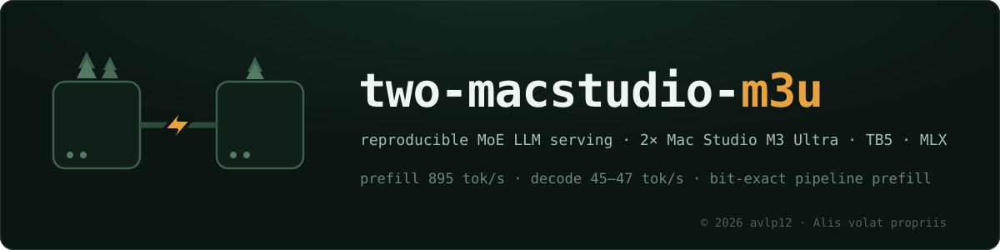

<!-- markdownlint-disable MD013 -->
# two-macstudio-m3u

<p align="center">
  
</p>


A reproducible playbook for serving large MoE LLMs on a **2 × Mac Studio M3 Ultra (512 GB)**
cluster linked by **Thunderbolt 5**, using MLX.

The target this repo is written against, and the number you should be able to reproduce:

> **DeepSeek-V4-Flash-0731, 4-bit, served across both boxes: prefill 1012 tok/s on a 13.9K-token
> prompt (TTFT 13.7 s), decode 45–47 tok/s single-stream / 112–117 tok/s aggregate at batch 8.**

One-page summary of the full result set (prefill pipeline, decode levers, observability,
reliability): [`assets/infographic.png`](assets/infographic.png).

This root README is the **model-agnostic layer**: hardware, wiring, network configuration,
software pinning, the safety rules, and how to verify your interconnect before you load a
single weight. The model-specific reproduction lives in **[`dsv4f/README.md`](dsv4f/README.md)**,
and the numbers you should compare your own run against are in
**[`dsv4f/EXPECTED_RESULTS.md`](dsv4f/EXPECTED_RESULTS.md)**.

Read [§ The honest reproducibility gap](#the-honest-reproducibility-gap) before you start.
There is one dependency we cannot hand you cleanly, and it is better to know that now.

Related repos: [`avlp12/local-llm-serving`](https://github.com/avlp12/local-llm-serving)
(where this stack was developed, plus a second rig on the opposite architecture),
[`avlp12/alis-dwq`](https://github.com/avlp12/alis-dwq) (quantization/porting methodology),
[`avlp12/local-hardware-failures`](https://github.com/avlp12/local-hardware-failures)
(the crash postmortems the safety rules below came out of).

---

## 1. Hardware

| | |
|---|---|
| Nodes | 2 × Mac Studio, M3 Ultra, 512 GB unified memory (80-core GPU) |
| OS | macOS 26.5.2 (build 25F84) on both boxes — 26.x is required for TB-RDMA (`jaccl`) |
| Interconnect | 3 × Thunderbolt 5 cables, direct box-to-box, **no dock, no switch, no hub** |
| Control plane | ordinary LAN / Tailscale for ssh convenience — never in the collective path |

Throughout this repo the two machines are **box A** (rank 0, HTTP front end) and **box B**
(rank 1). Box A takes the `.1` address on each Thunderbolt subnet, box B takes `.2`.

### Why three cables (and why serving only uses one)

The M3 Ultra gives every Thunderbolt port its own bus — six ports, six buses, no shared
controller. `system_profiler SPThunderboltDataType` will show you this. So extra cables
scale nearly linearly for *bandwidth*, and not at all for *latency*:

| Configuration | `all_sum` @ 512 MB | small-message latency |
|---|---|---|
| 1 cable, `ring` (TCP) backend | 4.5–5.1 GB/s | 163.6 µs @ 4 KB |
| 3 cables, `ring` (TCP) | 9.6 GB/s (2.0×) | unchanged |
| 1 cable, `jaccl` mesh (RDMA) | **9.31 GB/s** | **21.2 µs @ 8 KB** |
| 3 cables, `jaccl-ring` (RDMA) | 15.46 GB/s | unchanged |

A single TB5 cable is already at line rate: `iperf3` measures ~47 Gbit/s one way and
39.9 + 40.0 ≈ 80 Gbit/s bidirectional, which is the TB5 nominal data rate. MTU 1500 is
enough — jumbo frames buy nothing. `--connections-per-ip` buys nothing either (the
bottleneck is the link, not the socket).

**We serve on one cable (`jaccl` mesh) and keep the other two down.** Adopting the 3-link
config for serving was measured and rejected: prefill +2.6% (it is compute-bound, not
bandwidth-bound) and bs8 aggregate decode −7% (it is latency-bound, and latency does not
move with cable count). The extra bandwidth is worth having only for genuinely
bandwidth-bound jobs — distributed hidden-state dumps, weight sync, ring-backend prefill
experiments.

Wiring we used, which the scripts assume:

```
en4 <-> en4   10.0.0.1 / 10.0.0.2    serving + control  (the only one normally up)
en5 <-> en5   10.0.1.1 / 10.0.1.2    extra, on demand
en3 <-> en3   10.0.2.1 / 10.0.2.2    extra, on demand
```

Your `enX` numbering will differ. `networksetup -listallhardwareports` maps Thunderbolt
ports to interface names — but **do not rely on that mapping being stable**: a Thunderbolt
re-enumeration renames ports, which is exactly how we lost a link (§2.3). The daemon probes
candidates instead; `TBNET_CAND` overrides the candidate list.

---

## 2. Network setup

Three things have to be true, and two of them are non-obvious.

### 2.1 Static IPs on the Thunderbolt interfaces

```bash
sudo ifconfig en4 inet 10.0.0.1 netmask 255.255.255.0      # box A
sudo ifconfig en4 inet 10.0.0.2 netmask 255.255.255.0      # box B
```

### 2.2 Turn off the "Thunderbolt Bridge" service — permanently

macOS ships a `Thunderbolt Bridge` network service that claims the Thunderbolt interfaces
and hands them DHCP/link-local addresses. If it is enabled, it will **come back after a
reboot and take your static IPs away**, and your launch will fail in a confusing place
(one rank reachable, the other not). Delete or disable the service on both boxes:

```bash
networksetup -listallnetworkservices                    # find its exact name
sudo networksetup -setnetworkserviceenabled "Thunderbolt Bridge" off
# if the interfaces are members of bridge0, remove them (this also prevents an L2 loop
# when you add the 2nd and 3rd cable):
sudo ifconfig bridge0 deletem en4
```

### 2.3 Restore the IPs at boot

`ifconfig` assignments do not survive a reboot. `cluster/tbnet-restore.sh` +
`cluster/com.alis.tbnet.plist` is a launchd daemon that reasserts them, retrying for two
minutes while the interfaces come up.

**Do not hardcode the interface.** Our first version pinned the address to `en4`. When a
Thunderbolt re-enumeration moved the cable to `en5`, the daemon dutifully assigned the
cluster IP to a port with no carrier — and macOS silently fell back to a USB-NCM link at
100baseTX. Nothing errored. Collectives ran **220x slower** (16 MiB all_sum: 790 ms vs
5.4 ms) and every measurement taken in that window was garbage. The script now picks a
port that has carrier *and* answers from the peer, and skips `bridge0` members so it can
never steal a link to a third machine. `cluster/tb_preflight.sh` is the matching
pre-launch check: it fails loudly if the peer is unreachable or throughput is below a
floor, which is the only automatic way to tell a healthy Thunderbolt link from the
USB-NCM fallback.

```bash
sudo cp cluster/tbnet-restore.sh /Users/Shared/tbnet-restore.sh
# box identity comes from the local hostname; no octet file needed
sudo cp cluster/com.alis.tbnet.plist /Library/LaunchDaemons/com.alis.tbnet.plist
sudo launchctl load /Library/LaunchDaemons/com.alis.tbnet.plist
```

### 2.4 The multi-link mDNS storm — keep the extra cables **down** by default

This one cost us twelve hours and is invisible until you look for it. With 3 × TB5 +
10 GbE + a stray Thunderbolt link to a third machine — five link-layer paths between
essentially the same pair of hosts, all bridged and discoverable — macOS goes into a
permanent mDNS conflict fight:

- `mDNSResponder` pegged at 100% CPU **continuously for 12+ hours**
- the local hostname silently renamed by the OS **438 times** (`hostname (349)`, `hostname (438)`, …) as conflict avoidance
- one link-local (169.254/16) address triple-assigned across three interfaces
- `netbiosd` crashed outright

None of that freezes the machine by itself, but running a 141 GB model load on a host
already fighting a background daemon war is strictly worse than running it clean.

**Fix — topology diet.** Standing configuration is **one** Thunderbolt cable (serving) plus
LAN. The other two Thunderbolt links come up only on demand, for bandwidth-bound
experiments.

**Never write the diet as a fixed list of interfaces.** We used to run
`ifconfig en2 down; en3 down; en5 down` from memory. After a re-enumeration moved the
serving cable onto `en5`, that habit would have taken the cluster link down every session.
`tb_diet` in `cluster/tb_preflight.sh` downs every Thunderbolt port *except* the one
currently carrying the cluster IP and any `bridge0` member, so it can never cut the link
it is supposed to protect. Historically the manual form was `ifconfig en5 down;
ifconfig en3 down` (and unplug the stray link to any
third machine). Effect was immediate: `mDNSResponder` CPU went 100% → 0.0–0.9% within the
same minute, and stayed there. Full writeup:
[local-hardware-failures/cases/2026-08-24-tb5-multilink-crash-marathon.md](https://github.com/avlp12/local-hardware-failures/blob/main/cases/2026-08-24-tb5-multilink-crash-marathon.md).

Do **not** mix 10 GbE into the collective ring. MLX's ring backend splits payload evenly
across connections with no bandwidth weighting, so a ~1.1 GB/s link becomes a straggler
and drags a 9 GB/s aggregate down to ~5.5 GB/s. Keep Ethernet as control plane only.

---

## 3. Software

```bash
python3.11 -m venv ~/venv_omlx063          # Python 3.11.15 here; omlx requires >=3.11,<3.14
~/venv_omlx063/bin/pip install -U pip
```

Pinned versions actually in production (`cluster/requirements-frozen.txt` is the full
`pip freeze` from the live box):

| Package | Pin |
|---|---|
| `mlx` / `mlx-metal` | `0.32.0` |
| `mlx-lm` | `git+https://github.com/ml-explore/mlx-lm@ab1806e8f5d6aa035973af194a1b9198ab4754dc` |
| `mlx-embeddings` | `git+https://github.com/Blaizzy/mlx-embeddings@32981fa4e8064ed664b52071789dd18271fe4206` |
| `mlx-vlm` | `git+https://github.com/Blaizzy/mlx-vlm@78b96eb5462141447b9a6b4943ef553891da56dd` |
| `dflash-mlx` | `git+https://github.com/jundot/dflash-mlx@b7f625504a733216d9e06caa3f7847a048241d94` |
| `omlx` | `0.6.3rc2` — **see the gap note below** |

Pin `mlx` exactly. `mlx==0.32.1` in this venv produced a **−7.6% regression** through a
native-extension ABI mismatch that silently fell back off the fast kernels — it did not
error, it just got slower. Related: a macOS 27 upgrade must be paired with mlx 0.32.1+
([mlx#4211](https://github.com/ml-explore/mlx/issues/4211)); do not move one without the other.

Install the identical venv on **both** boxes, at the same absolute path per user
(`$HOME/venv_omlx063`). Then apply the three oMLX overlay patches on both:
[`dsv4f/serving/patches/`](dsv4f/serving/patches/).

### The honest reproducibility gap

`omlx` 0.6.3rc2 is an inference-server overlay from [jundot/omlx](https://github.com/jundot/omlx)
that carries the DeepSeek-V4 model implementation (fused wsdpa prefill kernels, the native
DSA sparse indexer, the MTP/speculative machinery). **The stack does not run without it**,
and we can no longer produce the exact artifact we installed:

- On box A it was installed from a local source tree, `file:///private/tmp/omlx063` — **that directory no longer exists** (it lived in `/tmp` and was lost to a reboot).
- On box B it was installed from a wheel, `/tmp/omlx-0.6.3rc2-cp311-cp311-macosx_26_0_arm64.whl`, `sha256=d99c81498d51cd6d72e7bdc4f700f6f0ad19eb2a57fd6776bce170e4e08de84c` — **also gone**.

What we *can* give you, and have:

- The exact version string: `omlx==0.6.3rc2`, `Requires-Python >=3.11,<3.14`, and its full dependency pin set (`cluster/requirements-frozen.txt`).
- The recorded wheel filename and sha256 above, so if you obtain a 0.6.3rc2 wheel from upstream you can check whether it is bit-identical to ours.
- The three modules we patched, verbatim, with checksums — and those checksums match byte-for-byte across both of our boxes ([`dsv4f/serving/patches/`](dsv4f/serving/patches/)).

What this means for you: obtain `omlx` 0.6.3rc2 (or the nearest available release) from
upstream, install it into the venv, then apply our three patches. If upstream's 0.6.3rc2
differs from ours, the patch files will still tell you *what* has to be true — each one
documents the behavior it fixes, so you can port the same three changes forward. If the
patch targets have moved, `apply.sh` fails loudly rather than half-applying.

This is a real gap and we are not going to paper over it. Everything else in this repo —
network config, weights, aligned MTP head, serving code, benchmark harnesses — is fully
recoverable from public sources or from this repo.

*(Lesson, which is now a standing rule here: never leave a build source or a measurement
in `/tmp`.)*

---

## 4. Safety rules — read before your first launch

Distributed MLX on TB-RDMA fails in a way that is worse than a crash. These five rules are
each a postmortem, and they are encoded in `cluster/tp2_guard.sh`, which every sweep and
launch script should `source`.

- **R1 — `trap EXIT`.** Run the cleanup block on every failure path, not just the happy one.
- **R2 — NEVER `kill -9` a process stuck in a collective.** This is the important one. A jaccl (TB-RDMA) rank that dies abnormally mid-collective does not clean up: the macOS 26 TB-RDMA kernel path responds by corrupting queue-pair / DMA state. The visible symptom is **wired memory that no process owns** — we have repeatedly seen 88–96 GB per box held with zero owning PIDs. Nothing frees it. Nothing can be launched over it. The only cure is a reboot. So: send TERM, wait (the guard waits 3 minutes), and if it does not die, **stop and reboot that box** rather than escalating to KILL.
- **R3 — verify shutdown before chaining.** Next config only after zero surviving processes AND `wired < 50 GB` on **both** boxes. `tp2_chain_ok` does this check.
- **R4 — never auto-chain a graph-shape change.** MTP depth, TP degree, kernel switches. Launch those alone, attended.
- **R5 — risky or unvalidated distributed experiments run on the `ring` (TCP) backend, never `jaccl`.** A ring hang is killable without corrupting kernel state; an RDMA hang is not. Promote to jaccl only after the ring run is clean.

Two more operational facts worth internalizing:

- **Wired-memory leak → reboot.** If `vm_stat` shows tens of GB wired with no owning process, you are done experimenting on that box until it reboots. `serve_b.sh` refuses to launch above 120 GB wired for exactly this reason, and carries a sidecar killswitch that kills serving above 350 GB (a deliberate, documented R2 exception — at 350 GB the machine is about to become unusable anyway).
- **There are stochastic wedges, and you should plan around them, not be surprised by them.** On our worst day we logged 3 transient Metal errors and 2 collective wedges across ~12 hours of heavy two-box work — same code, same harness, recovered by relaunch or reboot every time. Two independent wedges both landed on the *first topic* of a bs1 sweep; the identical run had completed cleanly twice before. Design your long jobs to be **resumable per unit of work** (our 697-window hidden-state capture writes one file per window and skips what already exists — it survived exactly this). Never write measurements to `/tmp`.

`serve_b.sh` also encodes three launch gates worth copying into any launcher you write:
refuse to start over a surviving serving process (exit 41), refuse to start over leaked
wired memory (42), refuse to start if the MTP checkpoint is missing (43 — because if only
*one* box lacks the file, the other rank does not error, it hangs in a collective).

---

## 5. Verify the interconnect before you load any weights

Do this first. It takes a minute and it isolates "my cluster is wired wrong" from "my
model is slow".

```bash
export BOX_B=<user>@10.0.0.2         # ssh target of box B; key-based auth, no passphrase prompt

# copy the harness to the same absolute path on both boxes
sudo mkdir -p /Users/Shared/tb5_bench && sudo chown $(whoami) /Users/Shared/tb5_bench
cp cluster/bench.py cluster/jbench.py /Users/Shared/tb5_bench/
sed "s|BOX_B_USER@10.0.0.2|$BOX_B|" cluster/hostfile_ring.json.template > /Users/Shared/tb5_bench/hostfile_ring.json
scp -r /Users/Shared/tb5_bench $BOX_B:/Users/Shared/

# TCP ring backend
~/venv_omlx063/bin/mlx.launch --hostfile /Users/Shared/tb5_bench/hostfile_ring.json \
  -- ~/venv_omlx063/bin/python /Users/Shared/tb5_bench/bench.py

# RDMA (jaccl) — this is what serving uses
sed "s|BOX_B_USER@10.0.0.2|$BOX_B|" cluster/hostfile_jaccl2.json.template > /Users/Shared/tb5_bench/hostfile_jaccl2.json
scp /Users/Shared/tb5_bench/hostfile_jaccl2.json $BOX_B:/Users/Shared/tb5_bench/
~/venv_omlx063/bin/mlx.launch --hostfile /Users/Shared/tb5_bench/hostfile_jaccl2.json \
  -- ~/venv_omlx063/bin/python /Users/Shared/tb5_bench/jbench.py
```

Compare against the table in [§1](#1-hardware). If the ring numbers are near 4.5–5.1 GB/s
and jaccl is near 9.3 GB/s at 512 MB, your interconnect is correct.

**`MLX_METAL_FAST_SYNCH=1` is mandatory.** With `=0` (which some multi-node recipes set for
4-node mesh stability), an 8 KB dependent-chain `all_sum` costs **274.8 µs/op** instead of
**21.2 µs/op** — a 13× penalty that shows up as "TP2 decode is slower than one box" and is
easy to misattribute to the interconnect. All our hostfiles set it in `envs`, and the
serving scripts export it.

`jaccl` notes: it bootstraps **without sudo** from a hand-written hostfile using the
current TB interface names (`rdma_en4`). The `rdma` field is a per-peer array — index *i*
is the device used to reach peer *i*, `null` for self. Only **one** RDMA device per peer
can be wired in the mesh backend, which is why serving never uses more than one cable;
`jaccl-ring` (`cluster/hostfile_jaccl_r3.json.template`) is what strips across three.

---

## 6. Repo layout

```
README.md                    this file — cluster playbook, model-agnostic
LICENSE                      MIT (our code)
cluster/
  bench.py                   TB5 all_sum bandwidth/latency harness, ring backend
  jbench.py                  same, jaccl (RDMA) backend
  tbnet-restore.sh           boot-time TB IP restoration (launchd)
  com.alis.tbnet.plist       the launchd daemon
  tp2_guard.sh               the five lifecycle rules, as sourceable shell functions
  check_deploy_sync.sh       sha256-compare deployed files across both boxes
  hostfile_*.json.template   mlx.launch hostfiles: jaccl mesh / jaccl-ring 3-link / ring
  requirements-frozen.txt    full pip freeze from the production venv
dsv4f/                       DeepSeek-V4-Flash-0731 reproduction
  README.md                  step-by-step: weights -> venv -> deploy -> serve -> verify
  EXPECTED_RESULTS.md        the numbers to compare your run against
  serving/                   the server, the PP2 prefill stage, the oMLX patches
  align/                     MTP head alignment (capture, train, paired verification)
  bench/                     prefill benchmark + needle integrity harness
```

Note on language: all documentation in this repo is English. Inline comments inside the
larger Python modules under `dsv4f/` are in Korean — that is our working language, and we
chose not to machine-translate several thousand lines of load-bearing commentary and risk
drift from the code that is actually running. Every shell script, every entry point, and
all of the documentation is English.

---

## License & attribution

Copyright &copy; 2026 **avlp12** (*Alis volat propriis*). Code and documentation are released under the [MIT License](LICENSE); see [NOTICE](NOTICE) for third-party components. If this playbook helps your build, a link back is appreciated: [github.com/avlp12](https://github.com/avlp12) · [huggingface.co/avlp12](https://huggingface.co/avlp12) · X [@Alisvolatprop12](https://x.com/Alisvolatprop12).
